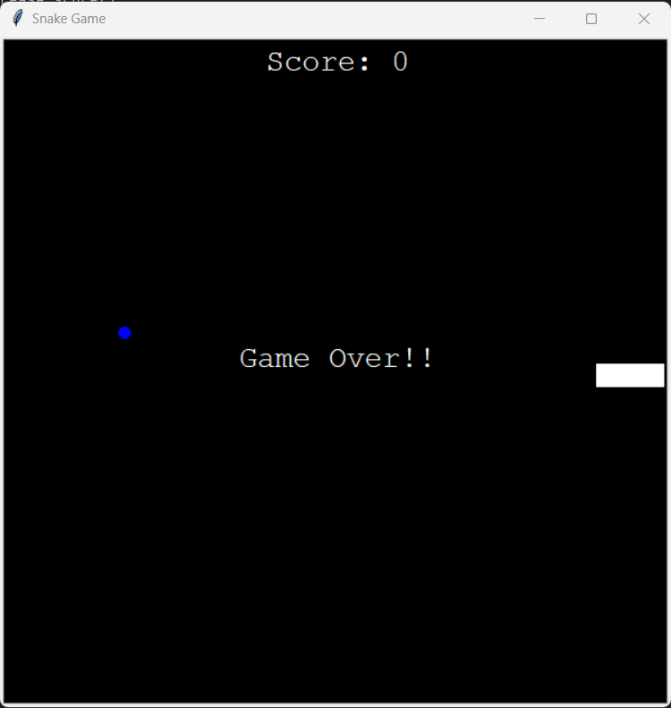

# Snake-game

# Snake Game in Python

  

Welcome to the Snake Game repository! This is a simple and fun implementation of the classic Snake Game using Python. The game allows you to control a snake that grows in length as it consumes food, with the objective of achieving the highest possible score without colliding with the boundaries or itself.

## Table of Contents

- [Features](#features)
- [Getting Started](#getting-started)
  - [Prerequisites](#prerequisites)
  - [Installation](#installation)
- [How to Play](#how-to-play)
- [Controls](#controls)
  

## Features

- Classic snake gameplay, easy to pick up and play
- Increasing difficulty as the snake grows longer
- Simple and intuitive controls
- Score tracking to keep challenging yourself for higher scores

## Getting Started

To get the game up and running on your local machine, follow the instructions below.

### Prerequisites

- Python 3.x
- Git (optional, for cloning the repository)

### Run the Game

- Download the file and run the main.exe file inside the folder 'dist'.

## How to Play

The objective of the game is to control the snake using the W, A, S, D keys and eat as much food as possible without colliding with the boundaries or the snake's own body. As the snake consumes food, it grows longer, making it increasingly challenging to navigate without collisions.

## Controls

Use the following keys to control the snake:

- W: Move the snake upwards
- S: Move the snake downwards
- A: Move the snake to the left
- D: Move the snake to the right

